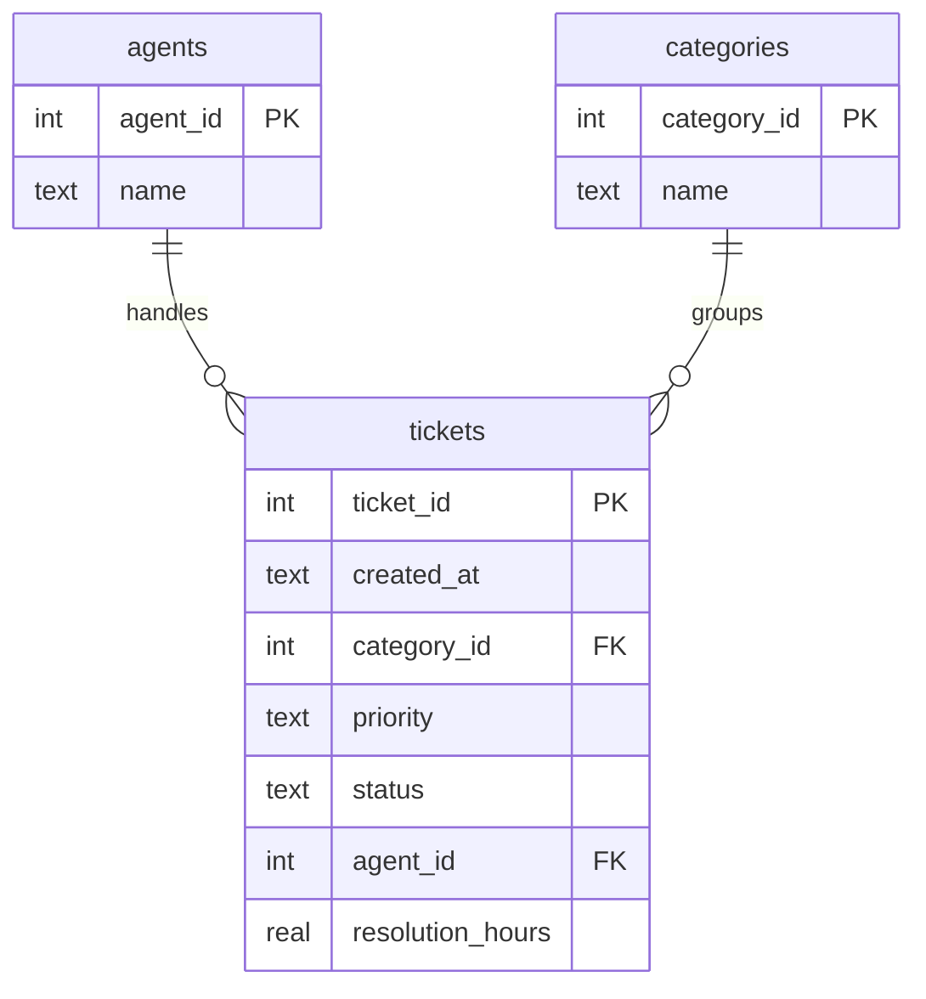
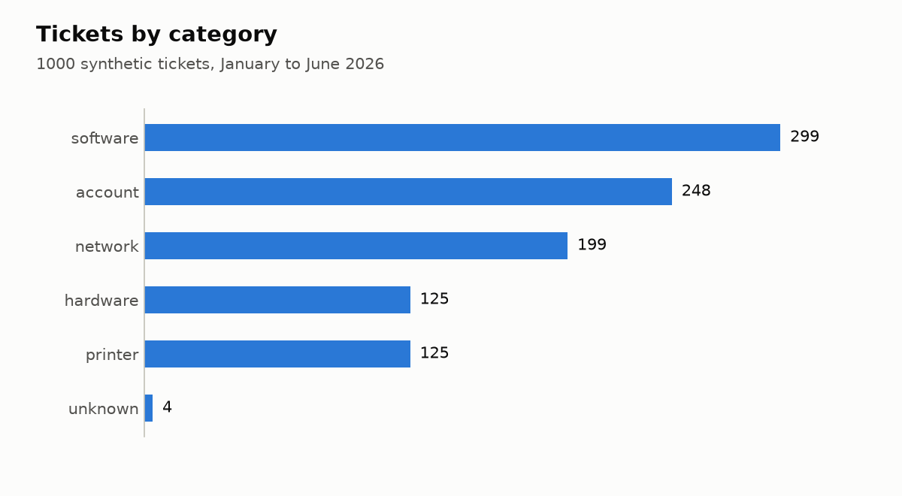
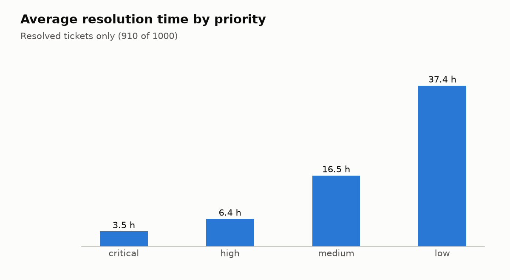
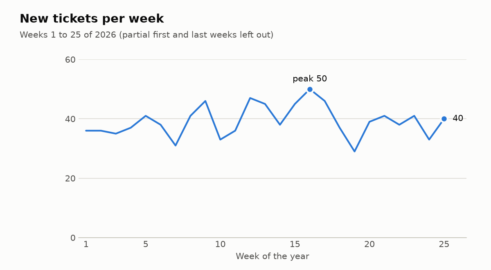

# Helpdesk Ticket Analytics

A small data project in Python and SQL. It builds a SQLite database of IT helpdesk tickets, cleans messy input data, answers five business questions with SQL, and draws three charts.

**Skills shown:** Python (csv, sqlite3, logging, pytest, matplotlib), SQL (JOIN, GROUP BY, CTE, CASE WHEN, window functions), data cleaning, database design, Git.

## Run it

```bash
git clone https://github.com/Domeek/helpdesk-ticket-analytics.git && cd helpdesk-ticket-analytics
python -m venv .venv && source .venv/bin/activate && pip install -r requirements.txt
python src/generate_data.py && python src/load_data.py && python src/run_queries.py && python src/make_charts.py
```

Run the tests with `pytest`.

## How it works

```
generate_data.py  ->  data/tickets.csv  ->  load_data.py  ->  data/helpdesk.db
 (fake tickets,         (1005 rows,         (clean + load)      (3 tables)
  fixed seed)            5 duplicates,                              |
                         16 messy rows)                  run_queries.py -> 5 SQL reports
                                                         make_charts.py -> reports/*.png
```

1. `src/generate_data.py` creates 1000 synthetic tickets (seed 42, so the file is the same on every run) and adds duplicates and messy values on purpose.
2. `src/load_data.py` drops 5 duplicate ticket ids, fixes 16 rows (extra spaces, wrong letter case, missing category) and loads 1000 tickets into SQLite. Every fix is logged.
3. `src/run_queries.py` runs the five queries in `sql/queries/` and prints each as a table.
4. `src/make_charts.py` draws the charts into `reports/`.

## Database schema



Agent and category names live in their own tables, so a name is stored once and a typo cannot create a second "category". `CHECK` constraints allow only valid priorities and statuses. `resolution_hours` is `NULL` for tickets that are not resolved, so averages skip them.

## Questions the SQL answers

| Query | Question |
|---|---|
| `01_tickets_by_category_priority` | How many tickets does each category get, split by priority? |
| `02_avg_resolution_by_agent` | Which agent resolves tickets the fastest? |
| `03_sla_breaches` | How many resolved tickets missed their SLA, per priority? |
| `04_agent_ranking_by_month` | How do agents rank each month? (window function `RANK() OVER`) |
| `05_weekly_ticket_trend` | How many tickets arrive each week? |

Example: SLA breaches (`03_sla_breaches`)

| priority | sla_hours | resolved_tickets | breached | breached_pct |
|---|---|---|---|---|
| critical | 4 | 55 | 25 | 45.5 |
| high | 8 | 191 | 66 | 34.6 |
| medium | 24 | 357 | 82 | 23.0 |
| low | 48 | 307 | 97 | 31.6 |

Example: average resolution time per agent (`02_avg_resolution_by_agent`)

| agent | resolved_tickets | avg_hours |
|---|---|---|
| Marta S. | 166 | 17.0 |
| Anna K. | 181 | 18.0 |
| Piotr W. | 182 | 20.7 |
| Ola N. | 199 | 21.8 |
| Tomasz B. | 182 | 25.3 |

## Charts





## Findings

The full write-up is in [`reports/summary.md`](reports/summary.md). In short:

1. Mondays bring 29% of all tickets, and software and account issues are 55% of them.
2. Critical tickets average 3.5 h, under the 4 h SLA, yet 45.5% of them still break it. The average hides the breaches.
3. Tomasz B. is the slowest agent overall (25.3 h against 17.0 h for Marta S.), but monthly rankings rest on 21 to 42 tickets per agent and change from month to month.

## Tests

`tests/test_helpdesk.py` has 5 tests: three for `clean_ticket` (dirty row, missing category, clean row left alone), one for duplicate removal, and one that runs the SLA query on a four-ticket database where the correct answer is known by hand.

## Limitations

- The data is synthetic. Patterns such as the Monday peak come from the generator settings, not from a real company.
- The SLA limits (critical 4 h, high 8 h, medium 24 h, low 48 h) are an assumption.
- Agents are compared on average resolution time only. The mix of ticket types is not taken into account.
- 90 tickets are unresolved and are left out of every average.

## License

MIT
